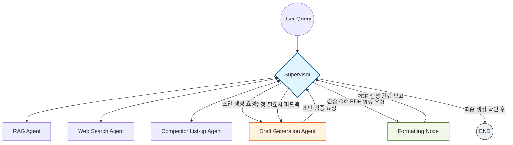

# Semiconductor Strategy Analysis Agent

## Subject

반도체 핵심 기술 전략 분석 (HBM4, PIM, CXL 집중)

---

## Abstract

## Overview
- **Objective** :
  반도체 핵심 기술(HBM4, PIM, CXL)에 대해 경쟁사의 기술 수준과 전략 변화를 분석하고,
  이를 자동으로 PDF 보고서 형태로 생성하는 AI Agent 기반 시스템 구축

- **Method** :
  Supervisor 기반 멀티 에이전트 구조를 통해
  문서 검색(RAG) + 웹 검색(Web) → 경쟁사 분석 → 보고서 생성 → PDF 변환까지
  End-to-End 파이프라인 구성

- **Tools** :
  LangGraph, OpenAI API, ChromaDB, Tavily Search

---

## Features
- PDF 및 기술 문서 기반 정보 추출
- Web Search 기반 최신 기술 동향 반영
- 경쟁사 자동 식별 및 기술 비교 분석
- TRL 기반 기술 성숙도 분석
- 전략 보고서 자동 생성 및 PDF 변환

- **확증 편향 방지 전략**
  - 긍정 / 부정 쿼리를 분리하여 검색 수행
  - 문서를 positive / negative / neutral로 라벨링
  - 균형 컨텍스트 구성으로 편향 방지
  - 다양한 출처 기반 교차 검증
  - 상충 정보 존재 시 조건부 판단

---

## Tech Stack

| Category   | Details                          |
|------------|----------------------------------|
| Framework  | LangGraph, LangSmith Python     |
| LLM        | GPT-4o-mini via OpenAI API       |
| Vector DB  | ChromaDB                         |
| Retrieval  | Chroma 기반 검색                 |
| Embedding  |sentence-transformers/paraphrase-multilingual-mpnet-base-v2|
| Search     | Tavily API                       |
| Output     | Markdown → PDF                   |

---
## Why `paraphrase-multilingual-mpnet-base-v2`

- 한국어 + 영어를 함께 처리해야 하는 다국어 환경에 적합
- 문장 의미 기반 유사도 성능이 높아 RAG 검색에 유리
- paraphrase(의역) 수준에서도 의미를 잘 잡아냄
- 성능 대비 속도와 안정성이 좋아 실무 적용에 적합

> 다국어 환경에서 의미 기반 검색 성능과 효율성을 동시에 확보하기 위해 선택

---

## Agents

- **Supervisor**
  - 전체 워크플로우 제어 및 흐름 관리

- **RAG Agent**
  - PDF 및 내부 문서 검색 (ChromaDB 활용)

- **Web Search Agent**
  - 최신 뉴스 및 기술 동향 수집

- **Competitor Agent**
  - 경쟁사 식별 및 분석 대상 정의

- **Report Agent**
  - 보고서 초안 생성

- **Formatting Node**
  - Markdown → PDF 변환

---

## Architecture



---
## Directory Structure
```
.
├── agents/
│   ├── competitor_agent.py
│   ├── formatting_node.py
│   ├── rag_agent.py
│   ├── report_agent.py
│   ├── states.py
│   ├── supervisor.py
│   └── web_search_agent.py
│
├── data/                          # PDF 및 기술 문서
│   ├── CXL_기술_동향.pdf
│   ├── 삼성_hotchips.pdf
│   ├── hbm4_시장동향.pdf
│   └── SK하이닉스_자료.pdf
│
├── outputs/
│   ├── chroma_db/                # ChromaDB 벡터 저장소
│   ├── evaluation_*.json
│   ├── retrieval_eval_result.json
│   ├── run.log
│   └── semiconductor_strategy_report_*.pdf
│
├── prompts/
│   └── templates.py
│
├── graph.py                      # LangGraph 정의
├── app.py                        # 실행 진입점
├── eval_retrieval.py             # 검색 성능 평가
├── eval_dataset.json             # 평가 데이터셋
├── requirements.txt
└── README.md
```
---
## RUN
```
python app.py \
  --query "HBM4, PIM, CXL 기술 경쟁사 전략 분석"
```

## Our GOAL

```
════════════════════════════════════════════════════════════
  반도체 기술 전략 분석 — 실행 결과 요약
════════════════════════════════════════════════════════════
  상태            : done
  수집 문서       : 22개
  검증 팩트       : 3개
  경쟁사 프로파일 : 6개

  ── 보고서 품질 평가 ──
  정확성      : 1.00  (기준 ≥ 0.80)
  최신성      : 0.89  (기준 ≥ 0.75)
  일관성      : 0.85  (기준 ≥ 0.80)
  편향 통제   : ✓
  교차 검증   : ✓
  최종 통과   : ✓ PASS

  재시도 횟수 : {'rag': 0, 'web_search': 1, 'competitor': 0, 'report': 0}
```

## Retrieval Performance

| Metric     | Score |
|------------|-------|
| Hit Rate@5 | 0.60  |
| MRR        | 0.60  |

> Top-5 기준 60% 정답 포함, 평균적으로 상위 2순위 내 정답 위치


## Contributors

본 프로젝트는 전 과정에 걸쳐 팀원 간 논의를 기반으로 공동 설계 및 구현되었으며,  
각 단계별 결과를 비교·검증하여 최종 방식을 선정하였습니다.

- **김민재** : Retrieval 전략 비교 및 선정 주도, 결과 품질 기준 정의 및 구조 보완  
- **박하정** : RAG 기반 Retrieval 및 Fact 추출 구현, 보고서 생성 구조 설계  
- **윤민후** : 데이터셋 및 평가 기준 정리, Retrieval 결과 비교 및 성능 검증  
